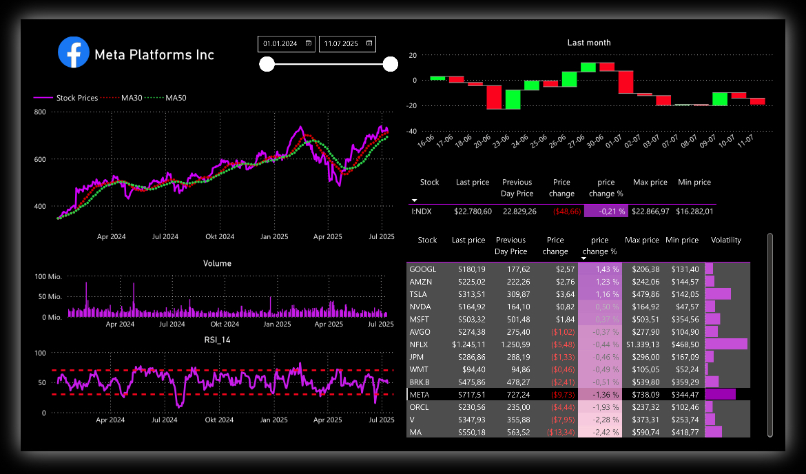
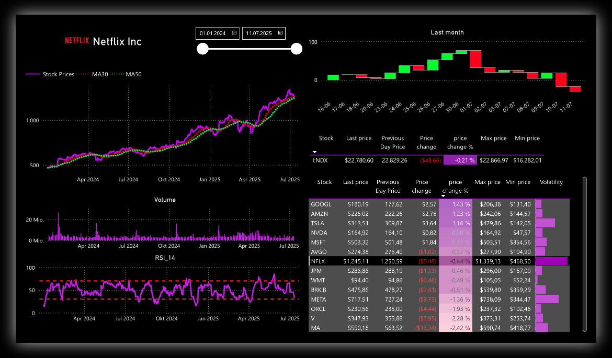
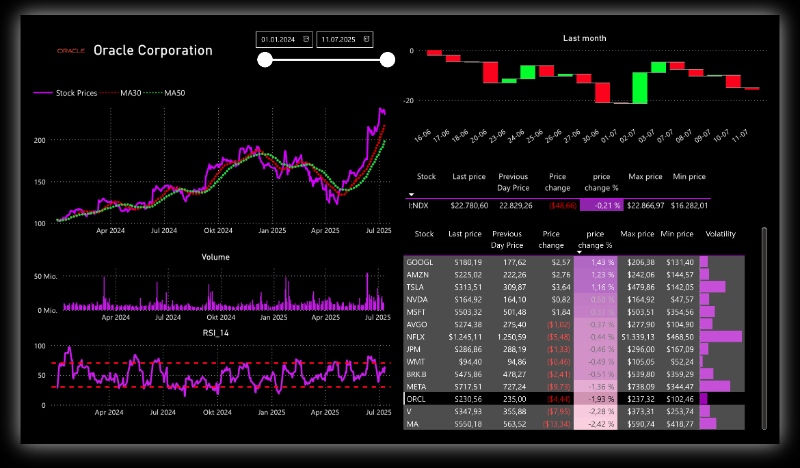

# Power BI Trading Dashboard 

A modern and dynamic **Power BI dashboard** for **visual analysis of stock prices** and **technical indicators**, using live data from the [polygon.io](https://polygon.io) API.

This project focuses on interpreting short-term price movements with clear, insightful visualizations.

---

##  Features

- Interactive charts of historical stock prices
- **RSI 14** (Relative Strength Index) per stock
- Trend detection via 30-day price movement
- **Waterfall chart** visualizing wins & losses
- Custom dark theme with purple accent colors
- Calendar table for time-based filtering

---

## Tech Stack

| Layer        | Tool/Language |
|--------------|---------------|
| Visualization | Power BI Desktop |
| Data Queries  | M Query (Power Query) |
| Calculations  | DAX (Data Analysis Expressions) |
| Data Source   | [polygon.io REST API](https://polygon.io)

---

## Requirements

- A **polygon.io account**
- A valid **API key**
- Power BI Desktop (recommended: latest version)

---

## Setup Instructions

1. Clone or download this repository.
2. Open the `.pbix` file in **Power BI Desktop**.
3. Go to **Transform Data → Parameters → API_Key** and enter your polygon.io API key.
4. Refresh the data (`Home → Refresh`).
5. Select your stocks of interest from the slicer and start analyzing!

---

## Example Visuals

*Coming soon:* screenshots or GIFs of the dashboard in action

---

# Preview
  
  
  

---

## Folder Structure

---

## License

This project is licensed under the **MIT License** – see [LICENSE](LICENSE) for details.

---

## Author

**Developed by Markus Elstermann**

Feel free to connect or contribute... elstermannmarkus@gmail.com  
Pull requests and feature suggestions are welcome!

